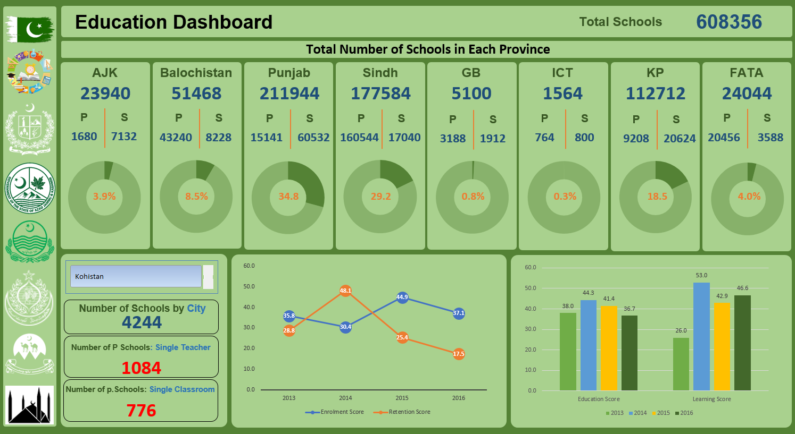
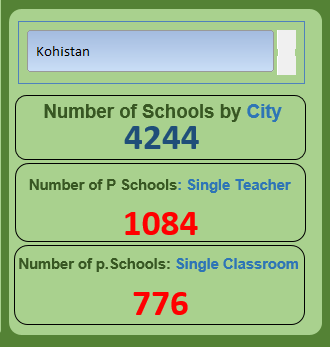
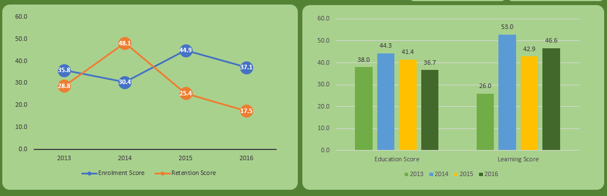

# 📊 Education Dashboard – Pakistan  
🚀 *An interactive Excel dashboard analyzing education data across Pakistan using pivot tables, slicers, and charts.*  

  

---

## 📌 Project Overview  
This project is an **interactive Excel dashboard** designed to analyze key education indicators across **cities in Pakistan**. Using **Pivot Tables, Slicers, and Dynamic Charts**, the dashboard provides insights into school distribution, student enrollment, retention rates, and education quality across various regions.  

### 🔹 Key Features:  
✅ **Dynamic Pivot Tables & Slicers** for city-wise insights  
✅ **Bar & Line Charts** to track enrollment & retention trends  
✅ **Interactive City-Wise Visualization** for better analysis  
✅ **Data Cleaning & Transformation** using Excel functions  

---

## 🛠 Tools Used
- **Microsoft Excel 2013+** – Pivot Tables, Charts, Conditional Formatting  
- **Power Query** – Data Cleaning & Transformation  
- **Google Maps Integration** – City-wise school distribution  
- **Slicers & Filters** – Dynamic interactivity  

---

## 📊 Key Insights from the Dashboard  
📌 **Education Indicators Analyzed:**  
- **Total Schools** – City-wise & Province-wise school distribution  
- **Primary & Secondary Schools** – Identifying gaps in education levels  
- **Single-Classroom & Single-Teacher Schools** – Measuring infrastructure challenges  
- **Enrollment & Retention Trends** – Tracking student progression  
- **Education & Learning Scores** – Understanding quality of education
  
---

## 📈 Visualizations in the Dashboard
📊 **Dynamic Charts Used:**  
- **City-wise School Distribution** – View schools per city dynamically using a Slicer filter  
- **Education Score vs. Learning Score (Bar Chart)** – Analyze the relationship between education quality and learning outcomes  
- **Enrollment & Retention Trends (Line Chart)** – Track how enrollment and retention scores change over the years  

    

---

## 📂 Project Structure
Education-Dashboard-Pakistan/ 

│── Data/

│ ├── Raw_Data.xlsx

│ ├── Cleaned_Data.xlsx

│

│── Dashboard/

│ ├── Education_Dashboard.xlsx

│

│── Screenshots/

│ ├── Dashboard.png

│ ├── City.png

│ ├── Scores.png

│

│── README.md

---

## 📌 How to Use the Dashboard?
1️⃣ **Download** the `Pakistan_Education_Dashboard.xlsx` file from the **Dashboard** folder.  
2️⃣ Open the file in **Excel 2013 or later versions**.  
3️⃣ Use the **Slicer for City Selection** to filter the data dynamically.  
4️⃣ Explore **interactive charts & KPIs** to analyze education trends.  

---

## 🚀 Future Improvements
✔️ Integrate **Power BI** for advanced visualizations  
✔️ Add **more KPIs** on government spending & education policies  
✔️ Implement **Predictive Analytics** using Python  

---

## 📌 Connect with Me  
💡 Let’s discuss: *How do you visualize education data?* Drop your thoughts in the comments!  

📧 **Email:** awaisiqbal_shah@yahoo.com  
🔗 **LinkedIn:** [Your LinkedIn Profile](https://www.linkedin.com/in/awaisiqbalshah)  
📌 **GitHub Repo:** [Education Dashboard Project](https://github.com/awaisiqbalshah/Education-Dashboard-Pakistan)  

🎉 **If you find this project useful, give it a ⭐ on GitHub!** 🚀  
